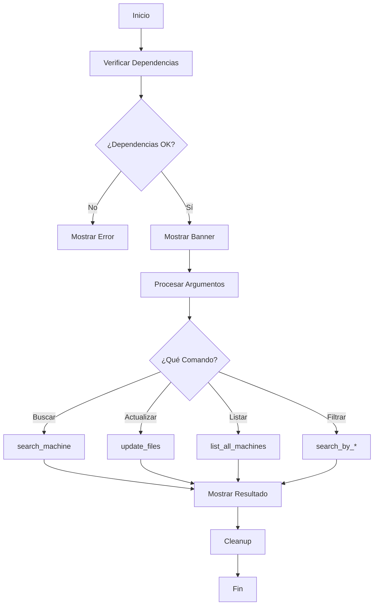

# SEARCHTHEBOX

<div align="center">


**Herramienta avanzada de búsqueda e inteligencia para máquinas de HackTheBox**

[Características](#-características) •
[Instalación](#-instalación) •
[Uso](#-uso) •
[Documentación](#-documentación) •
[Contribuir](#-contribuir)

</div>

---

## Descripción

**SearchTheBox** es una herramienta de línea de comandos diseñada para hackers éticos, pentesters y entusiastas de la ciberseguridad que participan en la plataforma HackTheBox. Proporciona una interfaz intuitiva y potente para buscar, filtrar y obtener información detallada sobre máquinas de HackTheBox directamente desde tu terminal.

### ¿Por qué SearchTheBox?

<table>
<tr>
<td width="33%" align="center">
<br/>
<b>Ultra Rápido</b><br/>
Búsquedas instantáneas sin salir de la terminal
</td>
<td width="33%" align="center">
<br/>
<b>Elegante</b><br/>
Interfaz visual moderna con colores y símbolos
</td>
<td width="33%" align="center">
<br/>
<b>Completo</b><br/>
Múltiples filtros y opciones de búsqueda
</td>
</tr>
<tr>
<td width="33%" align="center">
<br/>
<b>Robusto</b><br/>
Código production-ready con manejo de errores
</td>
<td width="33%" align="center">
<br/>
<b>Informativo</b><br/>
Datos detallados de cada máquina
</td>
<td width="33%" align="center">
<br/>
<b>Actualizable</b><br/>
Base de datos siempre al día
</td>
</tr>
</table>

---

## Características

### Funcionalidades Principales

| Comando | Característica | Descripción |
|---------|---------------|-------------|
| `-m` | 🔎 **Búsqueda por Nombre** | Encuentra máquinas específicas por su nombre |
| `-i` | 🌐 **Búsqueda por IP** | Localiza máquinas usando su dirección IP |
| `-d` | 📊 **Filtro por Dificultad** | Filtra por Easy, Medium, Hard o Insane |
| `-o` | 💻 **Filtro por Sistema** | Busca máquinas Linux o Windows |
| `-s` | 🎯 **Filtro por Skills** | Encuentra máquinas por técnicas específicas |
| `-y` | 📺 **Enlaces YouTube** | Obtén links directos a resoluciones en video |
| `-l` | 📋 **Listado Completo** | Visualiza todas las máquinas disponibles |
| `-u` | 🔄 **Auto-actualización** | Mantén tu base de datos siempre actualizada |
| `-c` | 🧹 **Gestión de Caché** | Limpia logs y archivos temporales |
| `-v` | 📌 **Versión** | Muestra la versión actual del script |

### Características Técnicas

<div align="center">

```bash
✅ Modo Estricto Bash (set -euo pipefail)
✅ Validación de Entradas con Regex
✅ Manejo Inteligente de Señales
✅ Sistema de Logging Completo
✅ Verificación de Dependencias
✅ Colores ANSI Modernos
✅ Gestión Robusta de Errores
✅ Código Modular y Limpio
```

</div>

---

## Requisitos

### Sistema Operativo
- Linux (Ubuntu, Debian, Arch, Kali, Parrot, etc.)
- Bash 5.0 o superior
- Conexión a Internet (para actualizaciones)

### Dependencias Requeridas

```bash
curl       # Descarga de datos
awk        # Procesamiento de texto
grep       # Búsqueda de patrones
sed        # Edición de streams
tr         # Traducción de caracteres
md5sum     # Verificación de integridad
```

### Dependencias Opcionales

```bash
js-beautify  # Formateo JSON (recomendado)
sponge       # Operaciones in-place (recomendado)
```

---

## 🔧 Instalación

### Método 1: Instalación Rápida

```bash
# Clonar el repositorio
git clone https://github.com/yourusername/searchthebox.git

# Entrar al directorio
cd searchthebox

# Dar permisos de ejecución
chmod +x searchthebox.sh

# Actualizar la base de datos
./searchthebox.sh -u
```

### Método 2: Instalación Global

```bash
# Copiar a directorio del sistema
sudo cp searchthebox.sh /usr/local/bin/searchthebox

# Usar desde cualquier ubicación
searchthebox -h
```

### Instalación de Dependencias por Distribución

<details>
<summary><b>📦 Ubuntu/Debian</b></summary>

```bash
sudo apt update
sudo apt install curl gawk grep sed coreutils
sudo npm install -g js-beautify  # Opcional
sudo apt install moreutils        # Opcional (sponge)
```
</details>

<details>
<summary><b>📦 Arch Linux</b></summary>

```bash
sudo pacman -S curl gawk grep sed coreutils
sudo npm install -g js-beautify  # Opcional
sudo pacman -S moreutils         # Opcional (sponge)
```
</details>

<details>
<summary><b>📦 Kali Linux</b></summary>

```bash
# Dependencias principales ya instaladas
sudo npm install -g js-beautify  # Opcional
```
</details>

---

## 💻 Uso

### Sintaxis General

```bash
./searchthebox.sh [OPCIÓN] [ARGUMENTO]
```

### 📋 Referencia Rápida de Comandos

<table>
<tr>
<th>Comando</th>
<th>Descripción</th>
<th>Ejemplo</th>
</tr>
<tr>
<td><code>-m &lt;nombre&gt;</code></td>
<td>Buscar máquina por nombre</td>
<td><code>./searchthebox.sh -m tentacle</code></td>
</tr>
<tr>
<td><code>-i &lt;ip&gt;</code></td>
<td>Buscar por dirección IP</td>
<td><code>./searchthebox.sh -i 10.10.10.244</code></td>
</tr>
<tr>
<td><code>-d &lt;nivel&gt;</code></td>
<td>Filtrar por dificultad</td>
<td><code>./searchthebox.sh -d Easy</code></td>
</tr>
<tr>
<td><code>-o &lt;sistema&gt;</code></td>
<td>Filtrar por SO</td>
<td><code>./searchthebox.sh -o Linux</code></td>
</tr>
<tr>
<td><code>-s &lt;skill&gt;</code></td>
<td>Buscar por técnica</td>
<td><code>./searchthebox.sh -s "SQL Injection"</code></td>
</tr>
<tr>
<td><code>-y &lt;nombre&gt;</code></td>
<td>Obtener enlace YouTube</td>
<td><code>./searchthebox.sh -y tentacle</code></td>
</tr>
<tr>
<td><code>-l</code></td>
<td>Listar todas las máquinas</td>
<td><code>./searchthebox.sh -l</code></td>
</tr>
<tr>
<td><code>-u</code></td>
<td>Actualizar base de datos</td>
<td><code>./searchthebox.sh -u</code></td>
</tr>
<tr>
<td><code>-c</code></td>
<td>Limpiar caché</td>
<td><code>./searchthebox.sh -c</code></td>
</tr>
<tr>
<td><code>-v</code></td>
<td>Mostrar versión</td>
<td><code>./searchthebox.sh -v</code></td>
</tr>
<tr>
<td><code>-h</code></td>
<td>Mostrar ayuda</td>
<td><code>./searchthebox.sh -h</code></td>
</tr>
</table>

---

## Ejemplos Prácticos

### Buscar una Máquina Específica

```bash
./searchthebox.sh -m tentacle
```

**Salida:**
```
╔════════════════════════════════════════════════════════════╗
║            INFORMACIÓN DE LA MÁQUINA                       ║
╚════════════════════════════════════════════════════════════╝

  [Nombre]        Tentacle
  [IP]            10.10.10.244
  [Sistema]       🐧  Linux
  [Dificultad]    Hard
  [Skills]        OpenSMTPD, SMTP, Exploitation, Proxychains
  [Certificados]  OSCP
  [YouTube]       https://www.youtube.com/watch?v=...
```

### Buscar por Dirección IP

```bash
./searchthebox.sh -i 10.10.10.244
```

### Filtrar por Dificultad

```bash
# Máquinas fáciles
./searchthebox.sh -d Easy

# Máquinas difíciles
./searchthebox.sh -d Hard
```

**Salida:**
```
→ Buscando máquinas de dificultad: Easy

  1. Lame
  2. Legacy
  3. Devel
  4. Beep
  ...

Total: 47 máquinas
```

### Filtrar por Sistema Operativo

```bash
# Máquinas Linux
./searchthebox.sh -o Linux

# Máquinas Windows
./searchthebox.sh -o Windows
```

### Buscar por Técnica/Skill

```bash
# SQL Injection
./searchthebox.sh -s "SQL Injection"

# Buffer Overflow
./searchthebox.sh -s "Buffer Overflow"
```

### Obtener Video de Resolución

```bash
./searchthebox.sh -y tentacle
```

### Listar Todas las Máquinas

```bash
./searchthebox.sh -l
```

**Salida:**
```
╔════════════════════════════════════════════════════════════╗
║            LISTADO DE MÁQUINAS                             ║
╚════════════════════════════════════════════════════════════╝

1   Academy             2   Admirer             3   Air          
4   Archetype           5   Armageddon          6   Bank         
...

Total: 342 máquinas disponibles
```

### Actualizar Base de Datos

```bash
./searchthebox.sh -u
```

**Salida:**
```
╔════════════════════════════════════════════════════════════╗
║              ACTUALIZACIÓN DEL SISTEMA                     ║
╚════════════════════════════════════════════════════════════╝

→ Verificando actualizaciones...
✓ Base de datos actualizada exitosamente (1.2M)
```

---

## 📚 Documentación

### 📁 Estructura de Archivos

```
searchthebox/
├── searchthebox.sh              # Script principal
├── README.md                    # Documentación
├── assets/                      # Recursos
│   └── banner.png              # Banner del proyecto
└── ~/.cache/searchthebox/       # Directorio de caché
    ├── bundle.js                # Base de datos
    └── searchthebox.log         # Archivo de logs
```

### Sistema de Logs

Ubicación: `~/.cache/searchthebox/searchthebox.log`

Formato:
```
[2024-12-09 15:30:45] [INFO] Script execution started
[2024-12-09 15:30:46] [INFO] Searching machine: tentacle
[2024-12-09 15:30:46] [INFO] Machine found: tentacle
```

### Códigos de Salida

| Código | Significado |
|--------|-------------|
| `0` | Ejecución exitosa |
| `1` | Error general |
| `130` | Interrupción (Ctrl+C) |

---

## 🏗️ Arquitectura

### Flujo de Ejecución



### Componentes Principales

```
SearchTheBox
│
├── 🔧 Inicialización
│   ├── check_dependencies()
│   ├── init_directories()
│   └── show_banner()
│
├── 💾 Gestión de Datos
│   ├── update_files()
│   └── clean_cache()
│
├── 🔍 Búsquedas
│   ├── search_machine()
│   ├── search_by_ip()
│   ├── search_by_difficulty()
│   ├── search_by_os()
│   └── search_by_skill()
│
├── 🎨 Utilidades
│   ├── colorize_field()
│   ├── draw_box()
│   └── log_message()
│
└── 🛡️ Gestión de Señales
    ├── cleanup()
    └── ctrl_c()
```

---

## 🗺️ Roadmap

### Versión 1.1 (Próximamente)

- [ ] Exportación a JSON/CSV
- [ ] Búsqueda por múltiples filtros simultáneos
- [ ] Estadísticas de máquinas completadas
- [ ] Integración con API oficial de HTB
- [ ] Modo interactivo con menús

### Versión 1.2 (Futuro)

- [ ] Recomendaciones basadas en skills
- [ ] Tracking de progreso personal
- [ ] Notas y marcadores personalizados
- [ ] Sincronización con perfil HTB
- [ ] Modo offline completo

### Ideas en Consideración

- [ ] Interfaz gráfica (TUI con ncurses)
- [ ] Plugin para Tmux/Zsh
- [ ] Integración con Obsidian/Notion
- [ ] Sistema de challenges personalizados
- [ ] Modo colaborativo para equipos

---

## 🤝 Contribuir

¡Las contribuciones son bienvenidas! Este proyecto sigue las mejores prácticas de código abierto.

### Cómo Contribuir

1. **Fork** el repositorio
2. **Crea** una rama (`git checkout -b feature/AmazingFeature`)
3. **Commit** tus cambios (`git commit -m 'Add: Amazing Feature'`)
4. **Push** a la rama (`git push origin feature/AmazingFeature`)
5. **Abre** un Pull Request

### 📋 Guía de Estilo

- Usar `snake_case` para funciones
- Usar `SCREAMING_SNAKE_CASE` para constantes
- Comentar código complejo
- Mantener `set -euo pipefail`
- Agregar validaciones de entrada
- Seguir convenciones existentes

### 🐛 Reportar Bugs

Abre un issue incluyendo:

- ✅ Descripción clara del problema
- ✅ Pasos para reproducirlo
- ✅ Comportamiento esperado vs. actual
- ✅ Sistema operativo y versión de Bash
- ✅ Logs relevantes

### 💡 Solicitar Features

1. Verifica que no exista en los issues
2. Describe claramente el feature
3. Explica el caso de uso
4. Proporciona ejemplos

---

## 📝 Changelog

### [3.0.0] - 2024-12-09

#### Agregado
- Sistema de búsqueda por dificultad (`-d`)
- Filtrado por sistema operativo (`-o`)
- Búsqueda por skills/técnicas (`-s`)
- Listado completo de máquinas (`-l`)
- Sistema de limpieza de caché (`-c`)
- Comando de versión (`-v`)
- Sistema de logging completo
- Validación de formato IP
- Verificación de conexión a internet
- Emojis para sistemas operativos
- Símbolos Unicode modernos
- Directorio de caché en `~/.cache/`

#### 🔧 Mejorado
- Refactorización completa del código
- Manejo de errores robusto
- Interfaz visual moderna
- Mensajes más descriptivos
- Documentación completa
- Arquitectura modular
- Performance de búsquedas

#### 🐛 Corregido
- Manejo de señales SIGTERM
- Limpieza de archivos temporales
- Validaciones de entrada
- Edge cases en búsquedas

---

## 🙏 Agradecimientos

- **HackTheBox** - Por proporcionar la plataforma
- **HTBMachines** - Por mantener la base de datos
- **Comunidad InfoSec** - Por el feedback constante
- **Contribuidores** - A todos los que aportan

---

## 📞 Contacto

**Autor**: Alberto Mario Orozco Ramirez

<div align="center">

</div>

**Proyecto**: [https://github.com/yourusername/searchthebox](https://github.com/yourusername/searchthebox)

---

## ⭐ ¿Te gustó el proyecto?

<div align="center">

Si **SearchTheBox** te resultó útil, considera:

⭐ Darle una estrella en GitHub  
🐛 Reportar bugs o sugerir features  
🤝 Contribuir con código  
📢 Compartirlo con la comunidad  

[](https://github.com/yourusername/searchthebox/stargazers)

</div>

---

<div align="center">

**Hecho con ❤️ para la comunidad de HackTheBox y S4vitar**


---

### 🔒 Nota de Seguridad

Este proyecto es una herramienta educativa para uso en entornos legales y autorizados.  
El autor no se hace responsable del mal uso de esta herramienta.

---

[⬆ Volver arriba](#-searchthebox)

</div>
